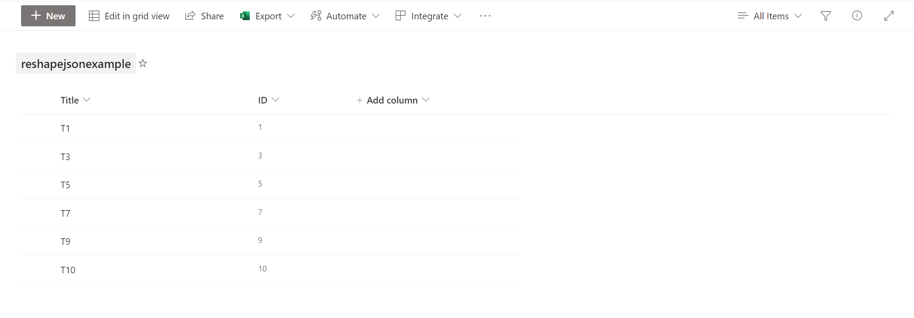
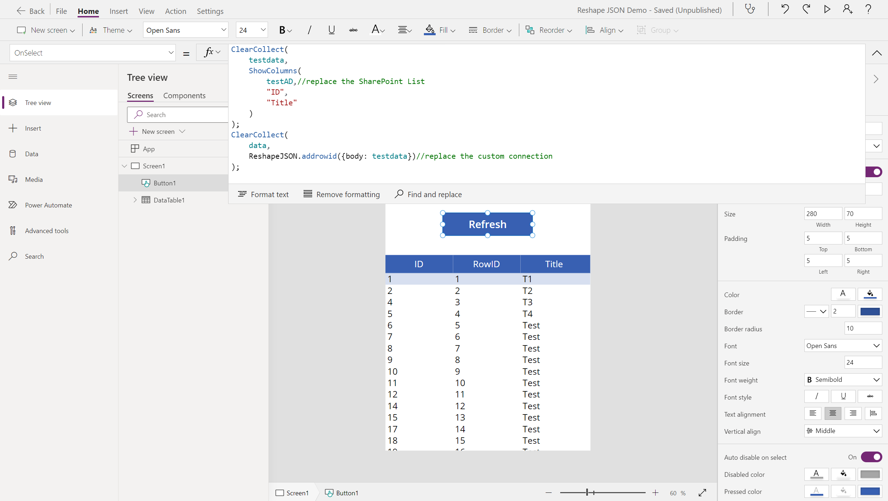

# Reshape JSON Demo

## This is a demo of how to reshape JSON with Azure Function App.

### Cloud services and tools used

[SharePoint](https://www.microsoft.com/en-sg/microsoft-365/sharepoint/collaboration/)

[Azure Functions](https://docs.microsoft.com/en-us/azure/azure-functions/functions-overview)

[Custom Connector](https://docs.microsoft.com/en-us/connectors/custom-connectors/)

[Power Apps](https://powerapps.microsoft.com/)

[Rust](https://www.rust-lang.org/)
