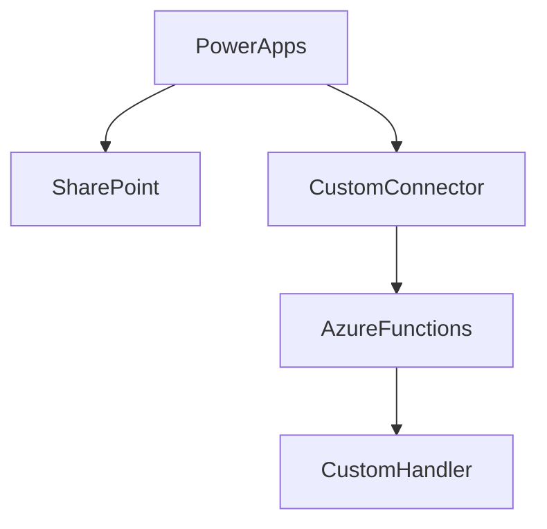

# Reshape JSON Demo

This is a demo of how to reshape JSON with Azure Functions.

---

## Cloud services and tools used

- [SharePoint](https://www.microsoft.com/en-sg/microsoft-365/sharepoint/collaboration/)

- [Azure Functions](https://docs.microsoft.com/en-us/azure/azure-functions/functions-overview)

- [Custom Connector](https://docs.microsoft.com/en-us/connectors/custom-connectors/)

- [Power Apps](https://powerapps.microsoft.com/)

- [Visual Studio Code](https://code.visualstudio.com/)

- [Rust](https://www.rust-lang.org/)

---

## Steps to run the demo

> Prerequisites
>
> - Power Apps(premium) & SharePoint licenses
> - Azure subscription

1. Clone the github repo to local.
2. Create the Function App in Azure and deploy the function.
3. Import the Postman collection and verify the API(addrowid).
4. Set up the custom connector in [Power Apps make portal](https://make.powerapps.com).
5. Create the SharePoint list.
6. Open the Power Apps from the portal, replace the custom connection and SharePoint list to verify if the function works.
